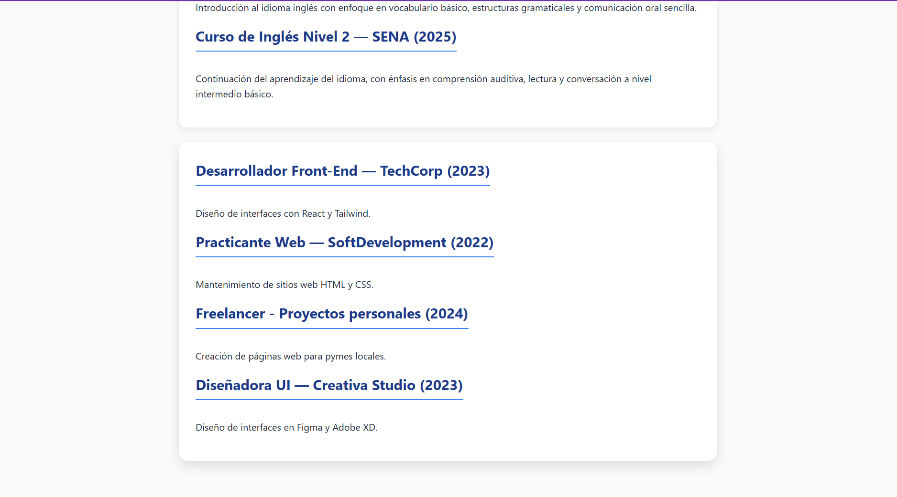

# 💼 Proyecto: Hoja de Vida con React (EV05)

Este proyecto hace parte de la **Evidencia EV05 - Construcción de un CV modular en React**, del programa **Tecnólogo en Análisis y Desarrollo de Software (SENA)**.

El objetivo es crear una **Hoja de Vida digital interactiva** compuesta por varios **componentes funcionales en React**, aplicando buenas prácticas de modularidad y diseño.

---

## 👩‍💻 Autora

**María Paula Herrera Rivas**  
📧 *[tu_correo@ejemplo.com]*  
📍 Colombia  
🗓️ *Noviembre de 2025*

---

### 🧩 Estructura del proyecto

El proyecto fue desarrollado con **React + Vite** y cuenta con los siguientes componentes principales:

| Componente | Descripción |
|-------------|-------------|
| `CabeceraCV.jsx` | Contiene la foto personal, nombre y datos básicos. |
| `Perfil.jsx` | Presenta el perfil profesional y habilidades clave. |
| `Experiencia.jsx` | Muestra la experiencia laboral y proyectos relevantes. |
| `Educacion.jsx` | Detalla la formación académica y cursos complementarios. |
| `App.jsx` | Componente principal que integra todos los anteriores. |

---

#### 🖼️ Captura de pantalla del resultado

> Vista previa del CV ejecutándose en el navegador:

---

##### ⚙️ Instrucciones para ejecutar el proyecto

Para ejecutar correctamente la aplicación de la hoja de vida, sigue estos pasos desde tu terminal:
# 🔹 1. Clonar el repositorio
Clona el proyecto desde GitHub en tu equipo local:
git clone https://github.com/MpaulaH/Clase_REACT.git

# 🔹 2. Acceder al proyecto React
Ingresa a la carpeta del proyecto donde está el código React:

cd Clase_REACT/Actividad_react_vite
# 🔹 3. Instalar las dependencias
Instala los módulos necesarios para que el proyecto funcione:

npm install
# 🔹 4. Ejecutar el proyecto en modo desarrollo
Ejecuta el comando:

npm run dev
Luego, espera a que se muestre un mensaje similar a:

VITE v5.0  ready in 500 ms
➜  Local:   http://localhost:5173/

# 🔹 5. Abrir el proyecto en el navegador
Copia o haz clic en el enlace (normalmente http://localhost:5173)
para ver tu hoja de vida ejecutándose.

